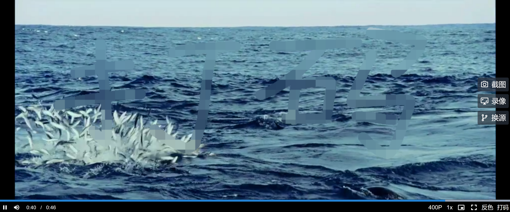

<div align="center">
<h3 align="center">基于 Video.js 深度定制的播放器</h3>

<p align="center">
    <a href="http://101.42.51.16/player/">在线演示</a>
  </p>
</div>

<details open>
  <summary>目录</summary>
  <ol>
    <li>
      <a href="#项目简介">项目简介</a>
      <ul>
        <li><a href="#技术选型">技术选型</a></li>
        <li><a href="#文件结构">文件结构</a></li>
      </ul>
    </li>
    <li><a href="#使用">使用</a></li>
    <li>
      <a href="#项目完成度与未来计划">项目完成度与未来计划</a>
      <ul>
          <li><a href="#已实现">已实现</a></li>
          <li><a href="#未来计划">未来计划</a></li>
      </ul>
    </li>
    <li>
      <a href="#设计文档">设计文档</a>
      <ul>
        <li><a href="#组件设计">组件设计</a></li>
        <li><a href="#功能模块设计">功能模块设计</a></li>
        <li><a href="#测试模块设计">测试模块设计</a></li>
      </ul>
    </li>
    <li><a href="#开源许可证">开源许可证</a></li>
    <li><a href="#联系我">联系我</a></li>
    <li><a href="#致谢">致谢</a></li>
  </ol>
</details>

## 项目简介

本项目是一个基于 Video.js 深度定制的现代播放器。支持多种格式，多种来源的视频播放。一并支持了以下功能：自适应动态标签切换清晰度并记忆进度；多场景录屏、截屏；自适应反色播放；自适应多路径打码。（涂抹打码、输入位置打码、自适应重绘）


### 技术选型

[![Vue][Vue]][Vue-url]  
[![Vite][Vite]][Vite-url]  
[![Vuetify][Vuetify]][Vuetify-url]  
[![Vitest][Vitest]][Vitest-url]  
[![ESlint][ESlint]][ESlint-url]  
[![Prettier][Prettier]][Prettier-url]  
[![Husky][Husky]][Husky-url]   
[![Pinia][Pinia]][Pinia-url]  
[![Video.js]][Video.js-url]

### 文件结构

```bash
│  App.vue
│  main.ts
│
├─assets
│  ├─css
│  │       controlbar.less  //底部控制栏样式
│  │       sidebar.less     //侧边栏样式
│  │
│  └─images
│          camera-outline.png      //截图图标
│          monitor-screenshot.png  //录屏图标
│          source-branch.png       //换源图标
│
├─components
│      CustomVideo.vue  //实现所有视频功能的SFC
│ 
├─store
│      videoState.ts    //定义了视频全局状态的Store
│
└─utils
    ├─invert
    │      invert.ts       //反色模块
    │      invert.test.ts  //反色模块测试
    │
    ├─pixelate
    │      pixelate.ts       //打码模块
    │      pixelate.test.ts  //打码测试模块
    │
    ├─quality
    │      qualitySwitching.ts   //切换清晰度插件模块
    │
    └─snapshot
           snapshot.ts   //多场景截图与录屏模块
```

## 使用

### 1. 选择视频源
可以在播放前和播放中切换 URL、文件、默认值等播放源。请注意，添加不同清晰度时需要点击右方加号。

### 2. 切换清晰度
如果您之前使用了多清晰度的源，在播放途中可以点击设置键进行切换。

### 3. 反色

播放中点击反色键即可反色，再点一次可以关闭反色。
### 4. 截图
点击截图键即可保存当前视频中的最新帧到本地。（如果处于马赛克或反转颜色状态则截取当前状态下的图片，如果同时处于马赛克和反转颜色状态则截取原视频。）

### 5. 录屏

点击录屏键开始录屏，点击结束键结束录屏并保存到本地。（录屏逻辑同截图。）
### 6. 打码
点击打码键可以选择打码区域，并且可以在打码区域涂抹。



## 项目完成度与未来计划

### 已实现

#### 核心功能

- [X] 自定义多来源播放（上传文件、URL、默认源）
- [X] 自适应动态标签切换清晰度并记忆进度
- [X] 多场景截屏（反转颜色与马赛克后多源截屏）
- [X] 多场景录屏（反转颜色与马赛克后多源录屏）
- [X] 自适应反色播放
- [X] 自适应多路径打码
  - [X] 涂抹打码
  - [X] 输入位置打码
  - [X] 自适应重绘
- [X] 支持 flv 播放
- [X] 支持 mov 播放
- [X] 支持编码格式为 H.265 格式的视频播放
- [X] 支持直播
  - [X] HLS

#### 前端工程化

- [X] 核心功能单元测试
- [X] 通过 Github Actions 实现持续集成与持续部署到云服务器
- [x] 使用 EsLint、Prettier、Husky 全过程统一规范代码
- [x] 引入 Less 预处理器全方位提升 CSS 开发效率
- [X] 搭建静态文件服务
- [X] 搭建页面展示服务

### 未来计划

- [ ] 明确反色与马赛克同时出现时的截屏与录屏逻辑；（项目内容要求中并未细化。具体实现时，反色与马赛克的源均直接来源于源视频，截图时如果同时反色与马赛克则截两张图。）
- [ ] 持续完善单元测试；
- [ ] 使用 Video.js 8 重构。（已尝试，由于 Video.js 8 对 TypeScript 的支持目前不佳作罢。）
- [ ] 迁移 CI/CD 流程到 Gitee Go；
- [ ] 引入 h265web.js-wasm-decoder 来提高播放 HEVC 视频的兼容性。

## 设计文档

### 组件设计
由于本项目中具体功能大都于易于扩展的功能模块中实现，因此组件数量并不复杂。

- CustomVideo 组件
  - 功能：实现了全部视频功能；向外提供数据源和自定义播放选项的接口（Props）

在根组件中引用此组件，并在 App.vue 实现了多来源视频的统一选择，日后项目复杂后易于扩展。

### 功能模块设计

封装了一些较复杂的功能模块（详情请参见注释）：

- pixelate.ts
- snapshot.ts
- invert.ts

### 测试模块设计

由于本项目主要基于成熟的组件库和 HTML 播放器进行开发，因此主要对核心算法进行单元测试。

- pixelate.test.ts
  - 功能：对打码算法的核心函数进行测试。
  - 具体实现：由于 Node.js 不支持 ImageData 的数据类型，因此自定义 ImgData 类，并对 2\*2 的图片数据进行了测试。
- invert.test.ts
  - 功能：对反转颜色的核心函数进行测试。
  - 具体实现：同样自定义 ImgData 类，对数据进行测试。

## 开源许可证

在 GPLv3 协议下分发，更多信息请参考 `LICENSE`。

## 联系我

曾德御 电子科技大学信息与软件工程学院

- Tel：15102801677
- Email：dariuszeng@qq.com
- Blog：https://runtimeerrorz.github.io/
- Résumé：[曾德御简历](./曾德御简历.pdf)

## 致谢

- [GitHub Actionsc](https://github.com/features/actions)
- [Materialize CSS](https://github.com/dogfalo/materialize)
- [Stack Overflow](https://stackoverflow.com/)
- [MDN Web Docs Canvas](https://developer.mozilla.org/zh-CN/docs/Web/API/Canvas_API)
- [Choose an Open Source License](https://choosealicense.com)
- [Material Design Icons](https://materialdesignicons.com/)
- [File Examples](https://file-examples.com/)
- [FFmpeg](https://ffmpeg.org/)
- [GPLv3](https://www.gnu.org/licenses/gpl-3.0.html)

[Vue]: https://img.shields.io/badge/Vue.js-35495E?style=for-the-badge&logo=vuedotjs&logoColor=4FC08D
[Vue-url]: https://vuejs.org/
[Vite]: https://img.shields.io/badge/Vite-20232A?style=for-the-badge&logo=vite
[Vite-url]: https://vitejs.cn/
[Vuetify]: https://img.shields.io/badge/Vuetify-aeddff?style=for-the-badge&logo=vuetify&logoColor=1697F6
[Vuetify-url]: https://next.vuetifyjs.com/
[Vitest]: https://img.shields.io/badge/Vitest-729b1b?style=for-the-badge&logo=vitest&logoColor=fcc72b
[Vitest-url]: https://cn.vitest.dev/
[ESlint-url]: https://eslint.org/
[ESlint]: https://img.shields.io/badge/eslint-101828?style=for-the-badge&logo=eslint
[Prettier-url]: https://prettier.io/
[Prettier]: https://img.shields.io/badge/prettier-1a2b34?style=for-the-badge&logo=prettier
[product-screenshot]: README_PIC/screenshot.png
[Husky]: https://img.shields.io/badge/husky-101828?style=for-the-badge&logoColor=1697F6
[Husky-url]: https://typicode.github.io/husky/
[Video.js]: https://img.shields.io/badge/video%20js-b33747?style=for-the-badge
[Video.js-url]: https://videojs.com
[Pinia]: https://img.shields.io/badge/pinia-9f43b5?style=for-the-badge&logo=data:image/svg+xml;base64,PHN2ZyBoZWlnaHQ9IjQ3NyIgdmlld0JveD0iMCAwIDMxOSA0NzciIHdpZHRoPSIzMTkiIHhtbG5zPSJodHRwOi8vd3d3LnczLm9yZy8yMDAwL3N2ZyIgeG1sbnM6eGxpbms9Imh0dHA6Ly93d3cudzMub3JnLzE5OTkveGxpbmsiPjxsaW5lYXJHcmFkaWVudCBpZD0iYSI+PHN0b3Agb2Zmc2V0PSIwIiBzdG9wLWNvbG9yPSIjNTJjZTYzIi8+PHN0b3Agb2Zmc2V0PSIxIiBzdG9wLWNvbG9yPSIjNTFhMjU2Ii8+PC9saW5lYXJHcmFkaWVudD48bGluZWFyR3JhZGllbnQgaWQ9ImIiIHgxPSI1NS4zNDIwNzUlIiB4Mj0iNDIuODE2OTMzJSIgeGxpbms6aHJlZj0iI2EiIHkxPSIwJSIgeTI9IjQyLjg2Mjg1NSUiLz48bGluZWFyR3JhZGllbnQgaWQ9ImMiIHgxPSI1NS4zNDg2NDIlIiB4Mj0iNDIuODA4MTAzJSIgeGxpbms6aHJlZj0iI2EiIHkxPSIwJSIgeTI9IjQyLjg2Mjg1NSUiLz48bGluZWFyR3JhZGllbnQgaWQ9ImQiIHgxPSI1MCUiIHgyPSI1MCUiIHkxPSIwJSIgeTI9IjU4LjgxMTI0MyUiPjxzdG9wIG9mZnNldD0iMCIgc3RvcC1jb2xvcj0iIzhhZTk5YyIvPjxzdG9wIG9mZnNldD0iMSIgc3RvcC1jb2xvcj0iIzUyY2U2MyIvPjwvbGluZWFyR3JhZGllbnQ+PGxpbmVhckdyYWRpZW50IGlkPSJlIiB4MT0iNTEuMzc3NjMlIiB4Mj0iNDQuNTg0NzE5JSIgeTE9IjE3LjQ3MjU1MSUiIHkyPSIxMDAlIj48c3RvcCBvZmZzZXQ9IjAiIHN0b3AtY29sb3I9IiNmZmU1NmMiLz48c3RvcCBvZmZzZXQ9IjEiIHN0b3AtY29sb3I9IiNmZmM2M2EiLz48L2xpbmVhckdyYWRpZW50PjxnIGZpbGw9Im5vbmUiIGZpbGwtcnVsZT0iZXZlbm9kZCIgdHJhbnNmb3JtPSJ0cmFuc2xhdGUoLTM0IC0yNCkiPjxnIHRyYW5zZm9ybT0ibWF0cml4KC45OTI1NDYxNSAuMTIxODY5MzQgLS4xMjE4NjkzNCAuOTkyNTQ2MTUgMzMuOTIyMDczIC45NzY2OTEpIj48cGF0aCBkPSJtMTAzLjk1MDUzNSAyNTguMjc0MTQ5YzQ0LjM2MTU5OS00LjM2MDgyNSA2MC4wMTQ1MDMtNDAuMzkxMjgyIDY1LjM1MzA5NC05NC42OTk0NDRzLTMwLjkzMjE5LTEwMy40NTEwMDEtNDYuMDIwMzQ3LTEwMS45Njc4MDc5Yy0xNS4wODgxNTYgMS40ODMxOTMyLTYzLjAzODUzMTMgNTguOTA1MTIzOS02OC4zNzcxMjIyIDExMy4yMTMyODY5LTUuMzM4NTkwOCA1NC4zMDgxNjIgNC42ODI3NzU0IDg3LjgxNDc5MSA0OS4wNDQzNzUyIDgzLjQ1Mzk2NXoiIGZpbGw9InVybCgjYikiIHRyYW5zZm9ybT0ibWF0cml4KC43MDcxMDY3OCAtLjcwNzEwNjc4IC43MDcxMDY3OCAuNzA3MTA2NzggLTgwLjQ5NjMzMiAxMjUuODkyOTQ0KSIvPjxwYXRoIGQ9Im0yNzUuODc2NzUyIDI1OC4yNzM5OTJjNDQuMzYxNiA0LjM2MDgyNiA1My4xNjcxMzMtMjkuMjY1MzIyIDQ3LjgyODU0Mi04My41NzM0ODUtNS4zMzg1OTEtNTQuMzA4MTYyLTUyLjA3MzEzMy0xMTEuNjEwNTc0NC02Ny4xNjEyOS0xMTMuMDkzNzY3NS0xNS4wODgxNTYtMS40ODMxOTMxLTUyLjU3NDc3IDQ3LjU0MDEyNzUtNDcuMjM2MTc5IDEwMS44NDgyODk1czIyLjIwNzMyOCA5MC40NTgxMzcgNjYuNTY4OTI3IDk0LjgxODk2M3oiIGZpbGw9InVybCgjYykiIHRyYW5zZm9ybT0ibWF0cml4KC43MDcxMDY3OCAuNzA3MTA2NzggLS43MDcxMDY3OCAuNzA3MTA2NzggMTkxLjQwMzM5OSAtMTQxLjg2MTk2MykiLz48cGF0aCBkPSJtMTg4LjM3MDAyNyAyMTYuODc2MzA1YzM5Ljk0MTgzNCAwIDUwLjk1MjY1LTM4LjI1MTk4NyA1MC45NTI2NS05Ny44OTg3NCAwLTU5LjY0Njc1MzItMzcuMzY3NzMzLTExOC4xMDEyNTk1Ni01MC45NTI2NS0xMTguMTAxMjU5NTZzLTUyLjA0NzM1IDU4LjQ1NDUwNjM2LTUyLjA0NzM1IDExOC4xMDEyNTk1NmMwIDU5LjY0Njc1MyAxMi4xMDU1MTYgOTcuODk4NzQgNTIuMDQ3MzUgOTcuODk4NzR6IiBmaWxsPSJ1cmwoI2QpIi8+PC9nPjxwYXRoIGQ9Im0xODQuNDczNDczIDUwMWM4My4xMTg4NTQgMCAxNTAuNTI2NTI3LTI0LjE0NTE0OCAxNTAuNTI2NTI3LTEzMy42NDUxNDhzLTY3LjQwNzY3My0xOTkuMzU0ODUyLTE1MC41MjY1MjctMTk5LjM1NDg1MmMtODMuMTE4ODU1IDAtMTUwLjQ3MzQ3MyA4OS44NTQ4NTItMTUwLjQ3MzQ3MyAxOTkuMzU0ODUyczY3LjM1NDYxOCAxMzMuNjQ1MTQ4IDE1MC40NzM0NzMgMTMzLjY0NTE0OHoiIGZpbGw9InVybCgjZSkiLz48ZWxsaXBzZSBjeD0iMjYwLjUiIGN5PSIzMzUiIGZpbGw9IiNlYWFkY2MiIHJ4PSIyMS41IiByeT0iMTAiLz48ZWxsaXBzZSBjeD0iMTAyLjUiIGN5PSIzMjkiIGZpbGw9IiNlYWFkY2MiIHJ4PSIyMS41IiByeT0iMTAiIHRyYW5zZm9ybT0ibWF0cml4KC45OTI1NDYxNSAuMTIxODY5MzQgLS4xMjE4NjkzNCAuOTkyNTQ2MTUgNDAuODU5MDMzIC0xMC4wMzkyOTIpIi8+PGcgdHJhbnNmb3JtPSJtYXRyaXgoLS45OTkzOTA4MyAuMDM0ODk5NSAuMDM0ODk5NSAuOTk5MzkwODMgMjY5LjI4NDgyNSAyNzEuMDI3NjY3KSI+PHBhdGggZD0ibTczLjEwNDY5ODUgNTguMjcyODc5NGM2LjczNzI0MTYgNC45MTMwMzMzIDE0LjMxMzI2MzIgNi42NjQwNTg3IDIyLjcyODA2NDkgNS4yNTMwNzYxIDguNDE0ODAxNi0xLjQxMDk4MjUgMTQuNTA1NDQ2Ni01LjI1MzU3NjkgMTguMjcxOTM0Ni0xMS41Mjc3ODMiIHN0cm9rZT0iIzAwMCIgc3Ryb2tlLWxpbmVjYXA9InJvdW5kIiBzdHJva2UtbGluZWpvaW49InJvdW5kIiBzdHJva2Utd2lkdGg9IjYiIHRyYW5zZm9ybT0ibWF0cml4KC45OTk4NDc3IC4wMTc0NTI0MSAtLjAxNzQ1MjQxIC45OTk4NDc3IDEuMDI2NDY0IC0xLjYyNDc5NCkiLz48cGF0aCBkPSJtMTU0LjUwMTEyNCAzYy01LjkzNzU0NSAwLTExLjMxMjc4MiAyLjQwNjI5ODA1LTE1LjIwMzY0NCA2LjI5NjgwNjIxLTMuODkwOTQgMy44OTA1ODUyOS02LjI5NzQ4IDkuMjY1NDU0NDktNi4yOTc0OCAxNS4yMDI2MzE3OSAwIDUuOTM3Njg4OCAyLjQwNjQ4OCAxMS4zMTI3NDIyIDYuMjk3MjkxIDE1LjIwMzQyNzIgMy44OTA4ODYgMy44OTA3NjczIDkuMjY2MTk3IDYuMjk3MTM0OCAxNS4yMDM4MzMgNi4yOTcxMzQ4IDUuOTM3MTA5IDAgMTEuMzExODk2LTIuNDA2Mzg4OSAxNS4yMDIzODctNi4yOTcyMzQ4IDMuODkwMjk5LTMuODkwNjUzNSA2LjI5NjQ4OS05LjI2NTY2MzYgNi4yOTY0ODktMTUuMjAzMzI3MiAwLTUuOTM3MTUyMS0yLjQwNjI0Mi0xMS4zMTE5NzgxLTYuMjk2Njc3LTE1LjIwMjUzMTgxLTMuODkwNDY5LTMuODkwNTg2NzQtOS4yNjUxODEtNi4yOTY5MDYxOS0xNS4yMDIxOTktNi4yOTY5MDYxOXoiIGZpbGw9IiMwMDAiIC8+PHBhdGggZD0ibTE1NCAyMWMwLTMuODY1NTQ5IDMuMTM1MzYyLTcgNi45OTk0MTMtNyAzLjg2NjM5OSAwIDcuMDAwNTg3IDMuMTM0NDUxIDcuMDAwNTg3IDdzLTMuMTM0MTg4IDctNy4wMDA1ODcgN2MtMy44NjQwNTEtLjAwMTE3MzUtNi45OTk0MTMtMy4xMzQ0NTEtNi45OTk0MTMtN3oiIGZpbGw9IiNmZmYiLz48cGF0aCBkPSJtMjQuNSAxM2MtNS45Mzc1MjkyIDAtMTEuMzEyNDI2IDIuNDA2MjY4LTE1LjIwMjk5NDI3IDYuMjk2NzE4MS0zLjg5MDY5NDY0IDMuODkwNTc2NS02LjI5NzAwNTczIDkuMjY1NDc2NS02LjI5NzAwNTczIDE1LjIwMjcxOTkgMCA1LjkzNzc1NDkgMi40MDYyNTk2MiAxMS4zMTI4MzkxIDYuMjk2ODE3NjYgMTUuMjAzNTE1MyAzLjg5MDU5MTA0IDMuODkwNzA5MiA5LjI2NTU2MTg0IDYuMjk3MDQ2NyAxNS4yMDMxODIzNCA2LjI5NzA0NjcgNS45MzcxMjQ5IDAgMTEuMzEyMjUxNC0yLjQwNjQxOSAxNS4yMDMwMzcxLTYuMjk3MzIyOSAzLjg5MDU0NDEtMy44OTA2NjIzIDYuMjk2OTYyOS05LjI2NTY0MTYgNi4yOTY5NjI5LTE1LjIwMzIzOTEgMC01LjkzNzA4Ni0yLjQwNjQ3MDMtMTEuMzExODgxMS02LjI5NzE1MS0xNS4yMDI0NDM3LTMuODkwNzYzLTMuODkwNjQ0OC05LjI2NTgxNTQtNi4yOTY5OTQzLTE1LjIwMjg0OS02LjI5Njk5NDN6IiBmaWxsPSIjMDAwIiAvPjxnIGZpbGw9IiNmZmYiPjxwYXRoIGQ9Im0xMzYgMjQuNDk5NDM4YzAgMTAuMjE4NTIzMiA4LjI4MjkxMSAxOC41MDA1NjIgMTguNTAxMTI0IDE4LjUwMDU2MiAxMC4yMTcwODkgMCAxOC40OTg4NzYtOC4yODIwMzg4IDE4LjQ5ODg3Ni0xOC41MDA1NjIgMC0xMC4yMTczOTkyLTguMjgxNzg3LTE4LjQ5OTQzOC0xOC40OTg4NzYtMTguNDk5NDM4LTEwLjIxODIxMyAwLTE4LjUwMTEyNCA4LjI4MjAzODgtMTguNTAxMTI0IDE4LjQ5OTQzOHptLTYgMGMwLTEzLjUzMTE5NTQgMTAuOTY5MjktMjQuNDk5NDM4IDI0LjUwMTEyNC0yNC40OTk0MzggMTMuNTMwODM4IDAgMjQuNDk4ODc2IDEwLjk2ODM3MTEgMjQuNDk4ODc2IDI0LjQ5OTQzOCAwIDEzLjUzMTk2MDctMTAuOTY3ODA4IDI0LjUwMDU2Mi0yNC40OTg4NzYgMjQuNTAwNTYyLTEzLjUzMjA2NCAwLTI0LjUwMTEyNC0xMC45Njg0NzI4LTI0LjUwMTEyNC0yNC41MDA1NjJ6IiBmaWxsLXJ1bGU9Im5vbnplcm8iIHN0cm9rZT0iI2ZmZiIgc3Ryb2tlLXdpZHRoPSIzIi8+PHBhdGggZD0ibTYgMzQuNDk5NDM4YzAgMTAuMjE4NTIzMiA4LjI4MTc4NzMgMTguNTAwNTYyIDE4LjUgMTguNTAwNTYyIDEwLjIxNzA4ODkgMCAxOC41LTguMjgyMDM4OCAxOC41LTE4LjUwMDU2MiAwLTEwLjIxNzM5OTItOC4yODI5MTExLTE4LjQ5OTQzOC0xOC41LTE4LjQ5OTQzOC0xMC4yMTgyMTI3IDAtMTguNSA4LjI4MjAzODgtMTguNSAxOC40OTk0Mzh6bS02IDBjMC0xMy41MzEyOTcgMTAuOTY4MjY4MS0yNC40OTk0MzggMjQuNS0yNC40OTk0MzggMTMuNTMwOTM5OCAwIDI0LjUgMTAuOTY4NDcyOCAyNC41IDI0LjQ5OTQzOCAwIDEzLjUzMTg1OTEtMTAuOTY4ODMgMjQuNTAwNTYyLTI0LjUgMjQuNTAwNTYyLTEzLjUzMTk2MiAwLTI0LjUtMTAuOTY4MzcxMS0yNC41LTI0LjUwMDU2MnoiIGZpbGwtcnVsZT0ibm9uemVybyIgc3Ryb2tlPSIjZmZmIiBzdHJva2Utd2lkdGg9IjMiLz48cGF0aCBkPSJtMjQgMzFjMC0zLjg2NTU0OSAzLjEzNDQ1MS03IDctN3M3IDMuMTM0NDUxIDcgNy0zLjEzNDQ1MSA3LTcgNy03LTMuMTM0NDUxLTctN3oiLz48L2c+PC9nPjxnIHN0cm9rZS1saW5lY2FwPSJyb3VuZCIgc3Ryb2tlLXdpZHRoPSIxMSI+PGcgc3Ryb2tlPSIjZWNiNzMyIj48cGF0aCBkPSJtNzAuNSAzNzcuNSA3NCA3NyIvPjxwYXRoIGQ9Im0xMzQuNSAzODYuNS00NyA1MCIvPjwvZz48ZyBzdHJva2U9IiNlY2I3MzIiIHRyYW5zZm9ybT0ibWF0cml4KC0xIDAgMCAxIDI5OCAzNzcpIj48cGF0aCBkPSJtLjUuNSA3NCA3NyIvPjxwYXRoIGQ9Im02NC41IDkuNS00NyA1MCIvPjwvZz48ZyBzdHJva2U9IiNmZmM3M2IiIHRyYW5zZm9ybT0ibWF0cml4KDAgMSAtMSAwIDIxNSAyMDcpIj48cGF0aCBkPSJtLjUuNSA0OSA0OSIvPjxwYXRoIGQ9Im0uNSAxMC41IDQ5IDQ5IiB0cmFuc2Zvcm09Im1hdHJpeCgtMSAwIDAgMSA1MCAwKSIvPjwvZz48L2c+PC9nPjwvc3ZnPgo=
[Pinia-url]: https://pinia.vuejs.org/zh/